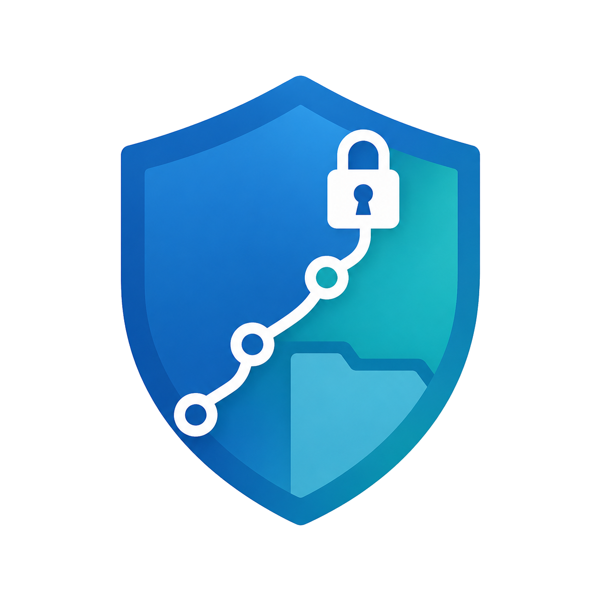
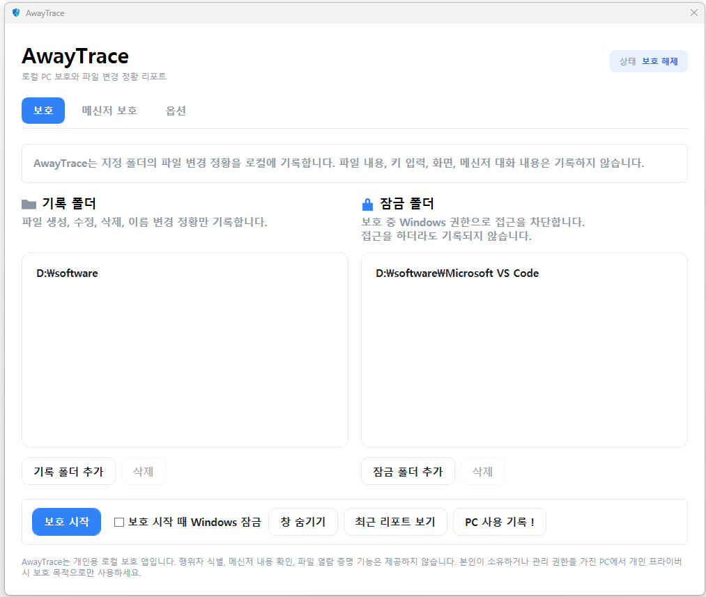

<p align="center">
  
</p>

<h1 align="center">AwayTrace</h1>

<p align="center"><b>자리비움·퇴근 후에도 보호 파일을 잠그고, 변경 정황을 로컬에만 기록하는 Windows 프라이버시 앱</b></p>

---

### 자리비움부터 퇴근 후까지, 내 PC의 흔적을 내 PC 안에만 남깁니다.

사무실에서 잠깐 자리를 비우거나 퇴근할 때마다 메신저를 잠그고, 업무 문서를 닫고, 폴더를 숨기는 일은 번거롭습니다. 그렇다고 PC를 그대로 두기에는 업무 파일, 개인 메신저, 민감한 문서가 신경 쓰입니다.

AwayTrace는 이런 불안을 줄이기 위해 만든 Windows용 로컬 프라이버시 앱입니다.

사용자가 보호 모드를 켜면 Windows 잠금과 함께 보호 세션이 시작되고, 복귀 후 PIN 인증을 통해 그 사이 발생한 파일 변경·PC 활동 정황을 타임라인으로 확인할 수 있습니다.

**가장 중요한 원칙은 하나입니다.**

AwayTrace는 클라우드에 저장하지 않습니다. 기록은 사용자의 PC 안에만 남으며, 파일 내용·화면·키 입력·메신저 내용을 수집하지 않습니다.

AwayTrace는 누가 했는지 특정하는 도구가 아닙니다. 대신 내가 자리를 비운 동안, 보호 대상 폴더와 PC에서 어떤 변화가 있었는지 조용히 기록해주는 개인용 보안 타임라인입니다.

> ⚠️ AwayTrace는 Windows 10/11 전용 데스크톱 프로그램입니다. 사용자 본인이 소유하거나 관리 권한을 가진 PC에서 개인 프라이버시 보호 목적으로만 사용하세요. 타인의 PC에 무단 설치하는 것은 법적 문제를 일으킬 수 있습니다.

## 주요 기능

### 1. 자리비움·퇴근 후 보호 모드 시작

AwayTrace에서 보호 모드를 켜면 Windows 잠금과 함께 보호 세션이 시작됩니다. 잠깐 자리를 비우는 상황부터 퇴근 후까지, 내 PC의 중요한 변화를 기록할 준비를 합니다.

### 2. 보호 대상 폴더 잠금

업무 문서, 견적서, 계약서, 개인 자료처럼 신경 쓰이는 폴더를 보호 대상으로 등록할 수 있습니다. 보호 모드가 켜져 있는 동안에는 해당 폴더 접근을 제한하고, 파일 생성·수정·삭제·이름 변경 정황을 함께 기록합니다.

### 3. 메신저 프라이버시 보호

카카오톡, 메일, 사내 메신저처럼 민감한 대화창을 보호 대상으로 등록할 수 있습니다. 보호 모드가 시작되면 선택한 메신저 창을 자동으로 숨기거나 종료해, 자리를 비운 사이 대화 내용이 노출될 가능성을 줄입니다.

### 4. 파일 변경·PC 활동 정황을 타임라인으로 확인

복귀 후 PIN 인증을 하면 보호 중 발생한 파일 변경, 보호 세션, 잠금·복귀 시각 등 주요 정황을 시간순으로 확인할 수 있습니다.

예: `14:12 - 파일 수정 - 견적서.xlsx`

### 5. 모든 기록은 내 PC에만 저장

AwayTrace는 클라우드에 기록을 저장하지 않습니다. 파일 내용, 화면, 키 입력, 메신저 내용은 저장하지 않으며, 보호 리포트는 사용자의 PC 안에만 남습니다.

## 화면

<p align="center">
  
</p>

## 이건 하지 않습니다 (프라이버시 원칙)

AwayTrace는 **감시·스파이웨어·포렌식·법적 증거 도구가 아닙니다.** 다음은 하지 않습니다.

- 인터넷 전송, 클라우드 업로드, 서버 저장 (모든 데이터는 내 PC에만)
- 파일 내용·키 입력·화면·클립보드·웹캠·마이크 기록
- 메신저 대화 내용, 읽음 여부, 상대방 정보 기록
- "누가 만졌는지" 행위자 식별, "파일을 열어봤는지" 증명

'파일이 바뀐 정황'과 '누가 파일을 열어봤는지'는 다릅니다. AwayTrace는 전자만 보여주며, 후자는 증명하지 않습니다. 자세한 원칙은 [PRIVACY.md](PRIVACY.md)를 봐주세요.

## 설치와 실행

- Windows 10/11에서 동작합니다. 받은 `AwayTrace.exe`를 실행하면 됩니다.
- 처음 실행 시 Windows가 파란 경고창("Windows가 PC를 보호했습니다")을 띄울 수 있습니다. 이는 바이러스라는 뜻이 아니라 **아직 제작자 인증(코드 서명)이 없는 개인 개발 앱**이라 뜨는 것입니다. `추가 정보 → 실행`을 누르면 됩니다.
- 첫 실행에서 앱 종료용 PIN(숫자 6자리 이상)을 설정합니다. 이 PIN은 Windows 로그인 비밀번호와 무관하며, 복구 수단이 없으니 잊지 마세요.

---

_아래는 개발/빌드 관련 기술 정보입니다._

---

## v0.1 범위

- 최초 실행 시 앱 종료용 PIN 설정
- PIN 평문 저장 금지
- PBKDF2-HMAC-SHA256 + 랜덤 salt 해시 저장
- PIN 최소 6자리
- PIN 5회 실패 시 30초 대기
- 기록 폴더 / 잠금 폴더 분리 등록 및 삭제
  - 기록 폴더: 파일 변경 정황만 기록
  - 잠금 폴더: 보호 중 Windows 권한(ACL)으로 접근 차단, 보호 종료 시 해제
- 보호 시작 시 SQLite 세션 저장
- `FileSystemWatcher` 기반 파일 이벤트 기록
  - 생성
  - 수정
  - 삭제
  - 이름 변경
- 2초 debounce로 중복 이벤트 억제
- watcher 오류 이벤트 기록
- 보호 시작 후 Windows `LockWorkStation` 호출
- 앱 숨김 / 다시 열기
  - 트레이 아이콘
  - `Ctrl+Alt+A` 단축키
  - 앱 재실행 시 기존 인스턴스 창 열기
- Windows 로그인 시 자동 실행 (옵션 탭에서 켤 때만 등록, 기본 꺼짐. 재부팅 복구 옵션을 켜면 함께 켜짐)
- 메신저/업무 앱 보호 (창 숨김/종료 보조 기능)
  - 공식 연동이 아니라 프로세스명 기반 보조 기능이며, 실행 자체를 확실히 차단하지 않음
  - 처리 방식: 그대로 두기 / 창 숨기기 / 종료하기
  - 보호 속도: 일반 250ms / 고속 100ms (고속은 CPU 사용량 증가 가능)
  - 카카오톡 / 네이트온 프리셋, 실행 중인 앱에서 추가 (직접 프로세스명 입력 UI 없음)
  - 대화 내용, 읽음 여부, 채팅방 정보는 기록하지 않음
- PC 사용 기록 (참고용)
  - AwayTrace 실행 / 종료 시각
  - Windows 잠금 / 잠금 해제 시각
  - Windows 이벤트 로그 6005/6006/6008 기반 컴퓨터 켜짐/꺼짐/비정상 종료 추정
  - 절전/모던 스탠바이 복귀는 포착되지 않을 수 있음
  - 표준 사용 시간 설정과 규격 외 사용 시간 표시
- 옵션 탭
  - 보호 시작 시 Windows 잠금 여부
  - 재부팅 후 이전 보호 모드 자동 복구 (복구 시 기록 공백 가능성 안내)
  - Windows 자동 실행 여부
  - 보호 시작 글로벌 단축키
  - PIN 변경
- Windows 세션 lock / unlock 이벤트 기록
- 강제 종료 또는 재시작 후 이전 활성 세션을 `기록 신뢰도 낮음`으로 표시
- PIN 인증 후 보호 종료
- 자리비움 리포트 화면
- 이벤트 유형 필터
- JSON / CSV 내보내기

## 하지 않는 것

- 서버 전송
- 클라우드 업로드
- 스크린샷
- 키 입력 기록
- 클립보드 기록
- 웹캠 / 마이크
- 파일 내용 읽기 또는 저장
- 파일 해시 저장
- 메신저 대화 내용 기록
- 메신저 읽음 여부 확인
- 채팅방 또는 상대방 정보 기록
- 행위자 식별
- 파일 열람 여부 증명
- 법적 증거 또는 포렌식 도구 주장

## 파일 열람/복사에 대한 입장

`FileSystemWatcher`는 파일 생성, 수정, 삭제, 이름 변경에는 강하지만 파일을 읽거나 복사하는 행위를 직접 알려주지 않습니다. AwayTrace는 이 한계를 숨기지 않습니다.

대신 폴더를 `잠금 폴더`로 등록하면 보호 중 Windows 권한(ACL)을 이용해 접근을 차단합니다. 이 기능은 열람/복사를 증명하는 기능이 아니라, 보호 중 접근을 막는 기능입니다. Windows 권한 적용에 실패하면 보호 시작을 취소합니다. 잠금은 현재 Windows 사용자 계정을 기준으로 적용되며, 다른 관리자 계정의 접근까지 막는 것을 보장하지 않습니다.

## v0.1 제외 기능

- USB 감지
- 원격접속 감지
- 회사 보안 에이전트 점검
- AI 요약

## 저장 위치

앱 데이터와 SQLite DB는 아래 로컬 경로에만 저장됩니다.

```text
%LocalAppData%\AwayTrace\awaytrace.db
```

주요 테이블:

- `settings`: PIN salt/hash, 실패 횟수, 잠금 해제 시각, 옵션 값
- `monitored_folders`: 기록/잠금 폴더 목록 (`folder_kind`로 구분)
- `sessions`: 보호 세션
- `file_events`: 파일 변경 정황 이벤트와 보호 관련 시스템 이벤트
- `protected_apps`: 사용자가 등록한 보호 앱 (표시 이름, 프로세스명, 실행 경로)
- `pc_usage_events`: PC 사용 정황 이벤트 (시각, 유형, 설명, 출처)

`file_events`에는 `timestamp`, `event_type`, `path`, `old_path`, `session_id`만 저장합니다. 파일 내용이나 해시는 저장하지 않습니다.

## 프로젝트 구조

```text
AwayTrace.sln
PLAN.md
README.md
src/
  AwayTrace.Core/
    Models/
    Services/
    Storage/
  AwayTrace.App/
    Services/
    ViewModels/
    Views/
tests/
  AwayTrace.Tests/
```

## 실행 요구사항

- Windows 11
- .NET 8 SDK

## 빌드

```powershell
dotnet build
```

## 테스트

외부 NuGet 테스트 프레임워크 없이 콘솔 기반 단위 테스트 러너를 사용합니다. `AwayTrace.Tests.csproj`는 `dotnet test`가 해당 러너를 실행하도록 `VSTest` 타깃을 정의합니다.

```powershell
dotnet test
```

## 실행

```powershell
dotnet run --project src\AwayTrace.App\AwayTrace.App.csproj
```

첫 실행 시 PIN 설정 창이 열립니다. PIN은 AwayTrace 보호 종료에만 사용되며 Windows 로그인 비밀번호와 연동되지 않습니다.

기본 보호 시작 단축키는 `Ctrl+Alt+A`입니다. 옵션 탭에서 변경하거나 끌 수 있습니다.

## 사용 흐름

1. 첫 실행에서 PIN을 설정합니다.
2. 메인 화면에서 기록 폴더 또는 잠금 폴더를 추가합니다.
3. `보호 시작`을 누르면 세션이 저장되고 watcher가 시작됩니다.
4. Windows 잠금에 성공하면 앱은 트레이에 남습니다.
5. 복귀 후 트레이 메뉴에서 `보호 종료`를 선택합니다.
6. PIN 인증에 성공하면 watcher가 중지되고 리포트 창이 열립니다.
7. 필요한 경우 JSON 또는 CSV로 리포트를 내보냅니다.

## 주의

AwayTrace 리포트는 파일 변경 정황을 보여줄 뿐입니다. 누가 변경했는지, 파일을 열람했는지, 특정 행위가 있었다는 법적 증거를 제공하지 않습니다.

PIN은 Windows 로그인 비밀번호와 연동되지 않고, 복구용 이메일이나 서버에도 저장되지 않습니다. PIN을 잊어버린 경우 앱 데이터를 삭제하고 다시 설정해야 합니다.

## 라이선스

이 프로젝트는 [MIT 라이선스](LICENSE)로 배포됩니다. 자유롭게 사용·수정·재배포할 수 있으며, 저작권 표시만 유지해 주세요.
