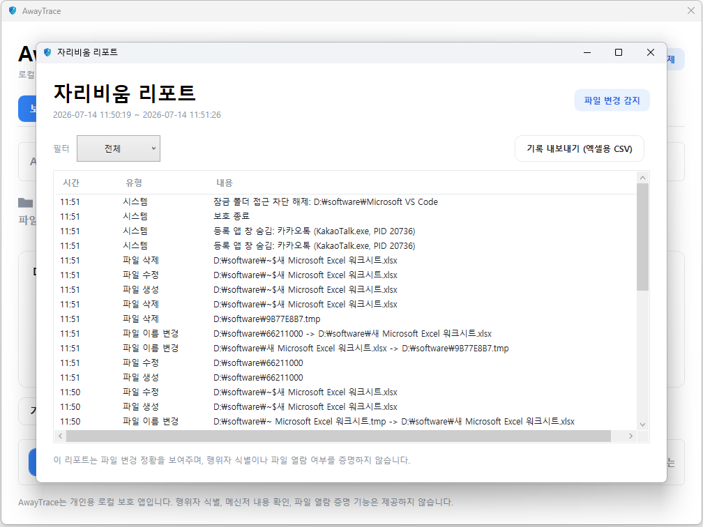
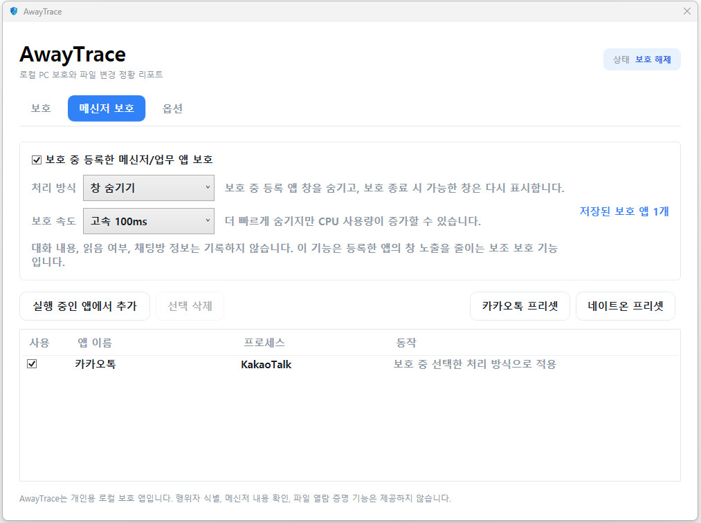
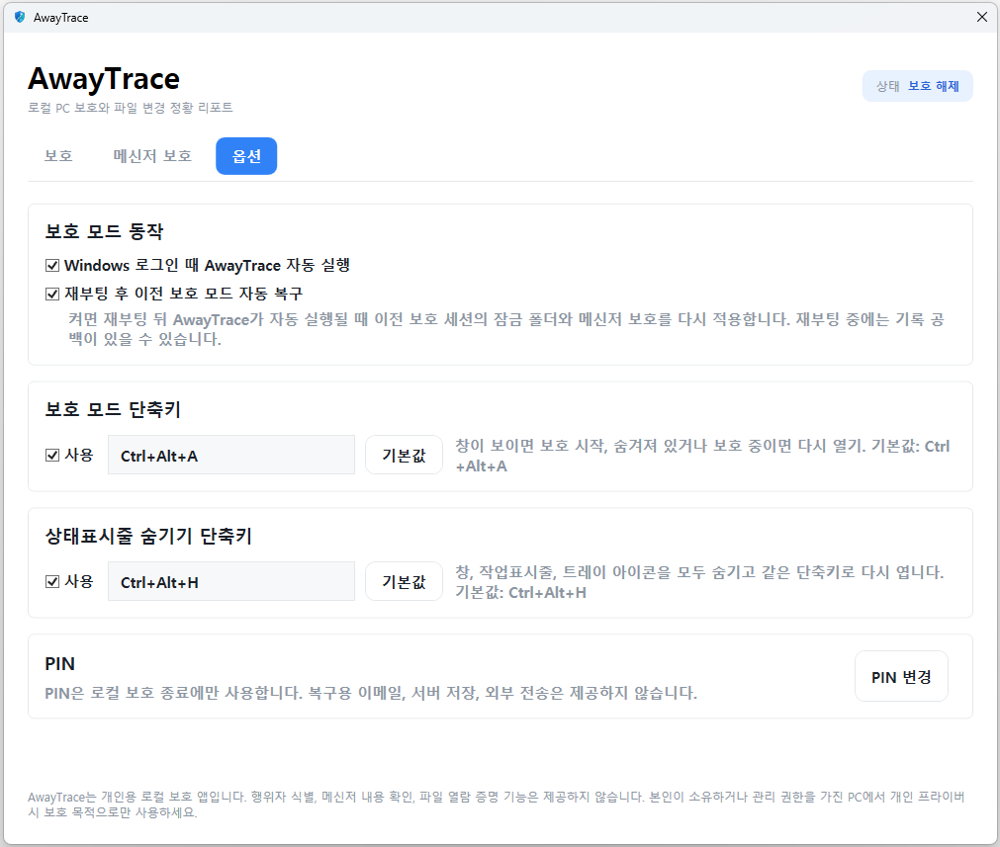
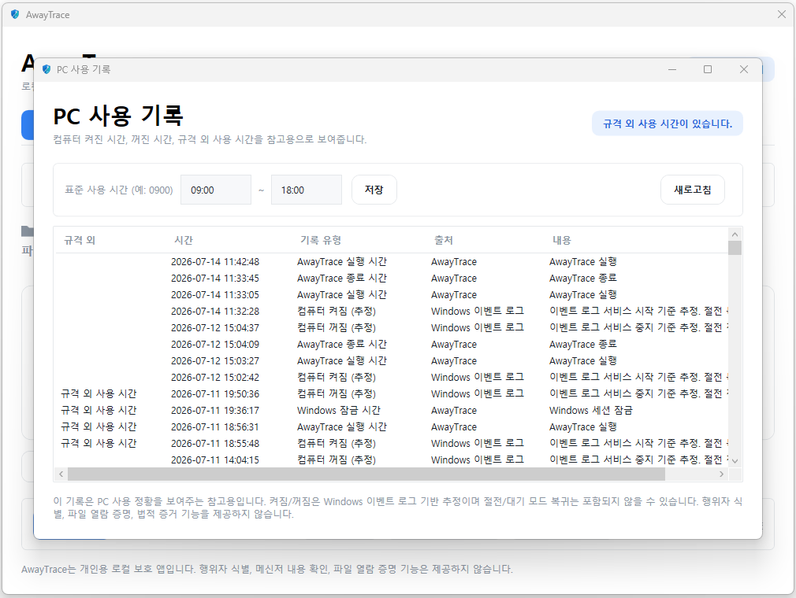

<p align="center">
  
</p>

<h1 align="center">AwayTrace</h1>

<p align="center"><b>A local-first Windows privacy app for away-from-PC file-change context and protected folder lockout.</b></p>

<p align="center">
  <a href="README.ko.md">한국어 README</a> ·
  <a href="PRIVACY.md">Privacy Principles</a>
</p>

---

AwayTrace is a Windows 10/11 desktop app for people who want a local record of what changed in selected folders while they were away from their own PC.

It is not spyware, employee monitoring software, a forensic tool, or an intruder identification tool. It does not upload data, read file contents, record keystrokes, capture screenshots, inspect clipboard data, use webcam/microphone input, or read messenger conversations.

AwayTrace shows **observed file-change context**, not proof that a file was opened or read.

## Screenshots

<p align="center">
  
</p>

<p align="center">
  
</p>

<details>
<summary>More screenshots (Messenger guard · Options · PC usage)</summary>
<p align="center"></p>
<p align="center"></p>
<p align="center"></p>
</details>

## Features

- Local-only SQLite storage under `%LocalAppData%\AwayTrace\awaytrace.db`
- PIN setup for stopping protection
- PIN hashing with PBKDF2-HMAC-SHA256 and a random salt
- 5 failed PIN attempts trigger a temporary lockout
- Separate folder modes:
  - record folders: record file created/changed/deleted/renamed events
  - locked folders: block access during protection using Windows/NTFS permissions
- FileSystemWatcher-based event recording with 2-second debounce
- Protection sessions with start/end timestamps
- Windows lock/unlock event recording
- Abnormal session recovery marked as low confidence
- Tray icon and window hide/show support
- Optional Windows startup registration
- Optional protection restore after reboot
- Protected app window assist for messengers/work apps:
  - leave as-is
  - hide window
  - close app
- PC usage context view:
  - AwayTrace app start/exit
  - Windows lock/unlock
  - Windows event log based power-on/shutdown/unexpected-shutdown estimates
- CSV export for report data

## What It Does Not Do

AwayTrace does not:

- send data to a server
- upload to cloud storage
- record screenshots
- record keystrokes
- record clipboard contents
- use webcam or microphone input
- read or store file contents
- store file hashes
- inspect messenger messages
- track messenger read status
- identify who performed an action
- prove that a file was opened or read
- claim to provide legal or forensic evidence

## Important Limitations

`FileSystemWatcher` can observe file creation, modification, deletion, and rename events. It cannot reliably detect that a file was merely opened, read, or copied.

Locked folders are different: when protection is active, AwayTrace applies Windows permissions to block access for the current Windows user account. This is a prevention feature, not proof of an access attempt. Denied access attempts are not recorded in v0.1.

## Responsible Use

⚠️ AwayTrace is a Windows 10/11 desktop program.

Use it only on a PC that you own or are authorized to manage, and only for personal privacy protection. Installing it on someone else's PC without permission may create legal problems.

## Install

Download `AwayTrace.exe` from the GitHub Releases page and run it.

Because this is an unsigned personal/open-source app, Windows SmartScreen may show an "Unknown publisher" warning. This does not automatically mean the app is malware. If you trust the release source, choose `More info` → `Run anyway`.

## Build From Source

Requirements:

- Windows 10/11
- .NET 8 SDK

Build:

```powershell
dotnet build
```

Test:

```powershell
dotnet test
```

Run:

```powershell
dotnet run --project src\AwayTrace.App\AwayTrace.App.csproj
```

Publish a single self-contained Windows x64 executable:

```powershell
cd src\AwayTrace.App
dotnet publish -c Release -r win-x64 --self-contained true -p:PublishSingleFile=true -p:IncludeNativeLibrariesForSelfExtract=true -p:DebugType=none
```

Output:

```text
src\AwayTrace.App\bin\Release\net8.0-windows\win-x64\publish\AwayTrace.exe
```

Only upload the single `AwayTrace.exe` file to Releases. Do not commit or upload local `publish/`, `bin/`, `obj/`, `.pdb`, or working-process files.

## Data Stored Locally

AwayTrace stores local settings and event data in:

```text
%LocalAppData%\AwayTrace\awaytrace.db
```

Main tables include:

- `settings`
- `monitored_folders`
- `sessions`
- `file_events`
- `protected_apps`
- `pc_usage_events`

`file_events` stores timestamp, event type, path, old path when applicable, and session ID. It does not store file contents.

## License

AwayTrace is released under the [MIT License](LICENSE).
